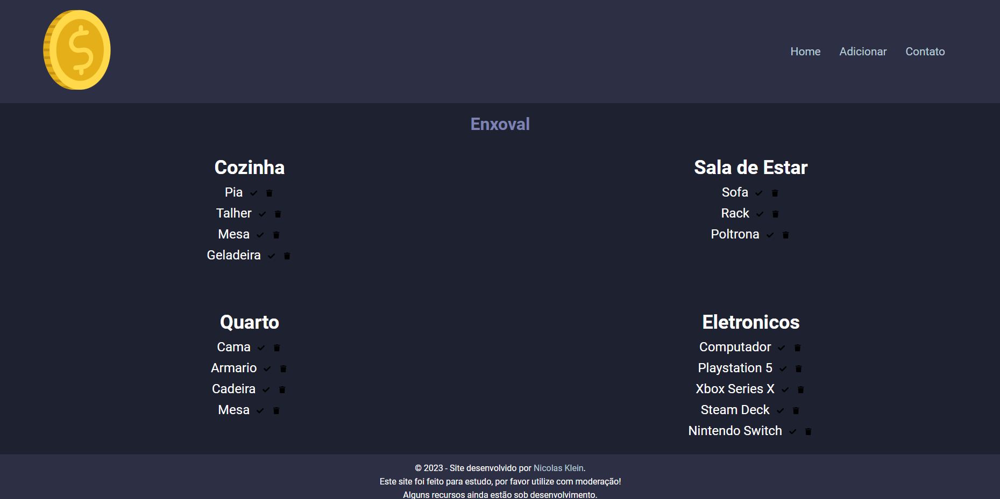
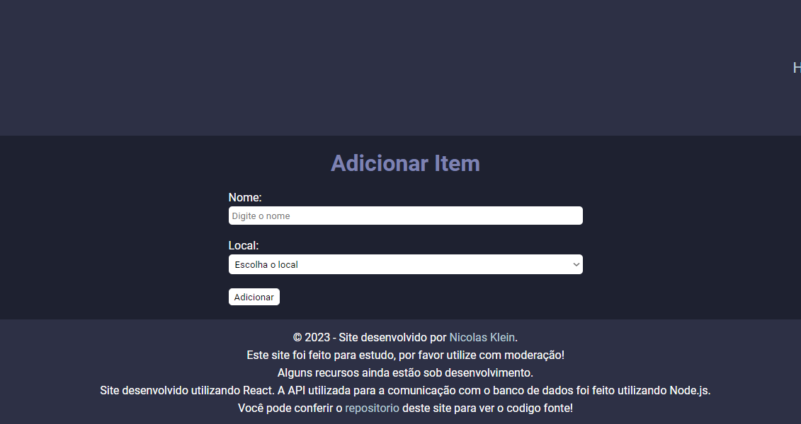

# Trousseau made with React and Node.js
   
 .
 ### Demo App: https://trousseau-project.netlify.app
# About
 This project is a trousseau that runs on the web and can be easily accessed on many devices.
 For the web page I used React and the API was made using Node.js.
 The API makes the communication between the web page and the database that stores all the data.
 If you want to add or remove an item on the site, please, use moderately.
 
 .
# Used Tecnologies
 ### Back-end
 - JavaScript
 - Node.js
 - Express
 - Mongoose
 - CORS
 - MongoDB Atlas

 ### Front-end
 - React
 - JavaScript
 - Axios
 - HTML
 - CSS

 ### Implantation
 - Website: https://trousseau-project.netlify.app
 - API: https://tousseau-project.onrender.com/api/items

# Author
 Nicolas Klein Faria de Araujo  
 https://nicolaskleinaraujo.github.io/portfolio/
